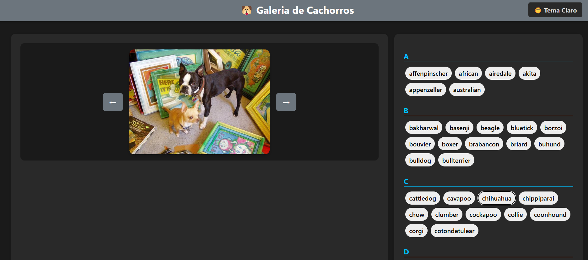

# 🐶 Galeria de Raças de Cachorros

Este é um projeto React interativo que consome a [Dog CEO API](https://dog.ceo/dog-api/) para listar raças de cachorros, exibir imagens em carrossel e permitir visualização responsiva com tema claro/escuro.



---

## 🎯 Funcionalidades

- ✅ **Listagem de Raças:**  
  Exibe todas as raças em ordem alfabética com suporte a sub-raças.

- 🖼 **Carrossel de Imagens:**  
  Ao clicar em uma raça, imagens aleatórias da raça são exibidas em um carrossel com botões de navegação.

- 🔎 **Pesquisa Dinâmica:**  
  Campo de busca para filtrar as raças pelo nome.

- 🌗 **Tema Claro/Escuro:**  
  Alternância de tema para melhorar a experiência do usuário.

- 📱 **Layout Responsivo:**  
  Funciona bem em desktops e dispositivos móveis com layout em grade (carrossel à esquerda e lista de raças à direita).

- 🧠 **Tratamento de Erros:**  
  Erros de rede e falhas da API são tratados com mensagens amigáveis.

---

## 🛠 Tecnologias Utilizadas

- **React 18+**
- **CSS Variables (Tema Claro/Escuro)**
- **Fetch API com `async/await`**
- **Dog CEO API** (https://dog.ceo)
- **Vite**
- **Yarn**

---

## 🚀 Instalação e Execução

### 1. Clone o projeto

```bash
git clone https://github.com/seu-usuario/galeria-dogs.git
cd galeria-dogs
```

### 2. Instale as dependências com Yarn

```bash
yarn
```

### 3. Inicie o servidor de desenvolvimento

```bash
yarn dev
```

### 4. Acesse no navegador

```
http://localhost:5173
```

---

## 📂 Estrutura do Projeto

```
galeria-dogs/
├── public/
│   └── vite.svg
├── src/
│   ├── components/
│   │   ├── Carousel.jsx
│   │   └── AlphabetBreedList.jsx
│   ├── App.jsx
│   ├── App.css
│   ├── styles.css
│   └── main.jsx
├── index.html
├── package.json
└── README.md
```

---

## 🧑‍💻 Autor

Feito  por **Michael XG**  
API fornecida por [Dog CEO](https://dog.ceo/dog-api/) 🐾